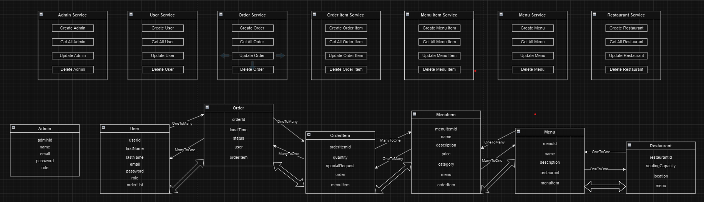

# Restaurant Management System

## Overview

This project is a basic Restaurant Management System (RMS) designed to handle the core functions of a restaurant. The system allows for managing menus, orders, tables, and customers. It is built with simplicity in mind, making it an ideal starting point for small to medium-sized restaurants.

## Features

* Menu Management: Create, read, update, and delete menu items.
* Order Management: Take customer orders, update order status, and manage order history.
 
* Customer Management: Store and manage customer information and preferences.

## Technology Stack

#### Backend: Java with SpringBoot and Maven
#### Database: Mysql

## Installation
### Prerequisites
* JDK and Maven
* Mysql installed and running

## Usage

### Restaurant Management
* Add a New restaurant: Fill out the form in the restaurant section to add a new restaurant.
* Update restaurant Information:  Click to update restaurant information including its location and seating capacity.
* Delete a restaurant: Click the delete button to delete restaurant.

### Menu Management
* Add a New Menu Item: Navigate to the Menu section and fill out the form to add a new item.
* Edit a Menu Item: Click the edit button next to the item you want to update.
* Delete a Menu Item: Click the delete button next to the item you want to remove.

### Order Management
* Create a New Order: Go to the Orders section and select items from the menu to create a new order.
* Update Order Status: Click on an order and change its status (e.g., from pending to completed).
* View Order History: Navigate to the Order History section to view past orders.

### Customer Management
* Add a New Customer: Fill out the form in the Customers section to add a new customer.
* Update Customer Information: Click on a customer to update their details.
* Delete a Customer: Click the delete button next to the customer you want to remove.

### Contact
For questions or suggestions, feel free to open an issue or contact us at [pthakur.pt36@gmail.com].

## DataBase

